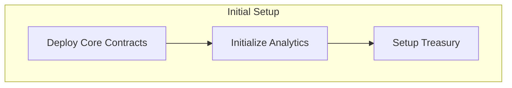

# RS Protocol Integration Guide

## Phase Sequence & Dependencies

## Distribution Schedule

1. First Retroactive Airdrop (7M)
2. Team Options (1M)
3. Dutch Auction (20M)
4. Second Retroactive Airdrop (7M)
5. Annual Bonus Program (21M)
6. LP Incentives (40M)
7. Treasury (4M)

